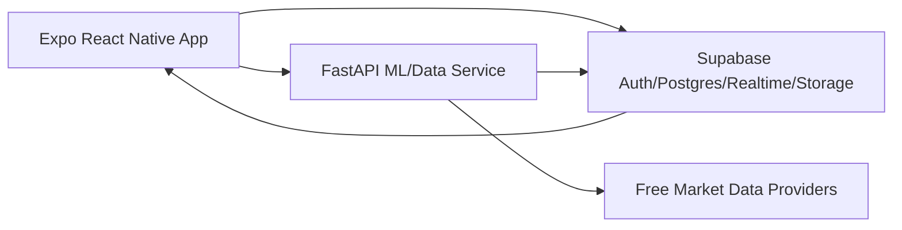

# FinSight Architecture

## Runtime Flow

1. The mobile app reads feed, profile, chat, watchlist, and engagement data from Supabase.
2. The mobile app requests candles and forecast scenarios from FastAPI.
3. FastAPI normalizes/cache market candles, generates explainable forecast bands, and writes forecast metadata to Supabase when real credentials are configured.
4. Expired forecasts are evaluated against realized candles and stored as accountability metrics.

## Responsible AI Boundary

Forecasts are presented as scenario analysis. Each forecast stores the model name, creation timestamp, horizon, confidence band, and backtest metrics. Published theses are locked after creation so historical results cannot be edited after the market moves.

## Scale Path

- Replace seeded mobile data with Supabase queries.
- Add scheduled ingestion jobs for market candles.
- Move FastAPI to a container host.
- Add Redis for feed/cache hot paths.
- Add queue workers for forecast generation and result evaluation.
- Swap the deterministic baseline forecaster for Kronos, TimesFM, Chronos, or an ensemble.
